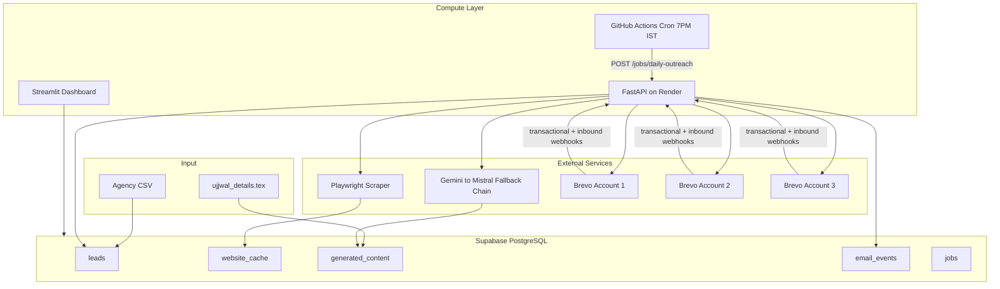
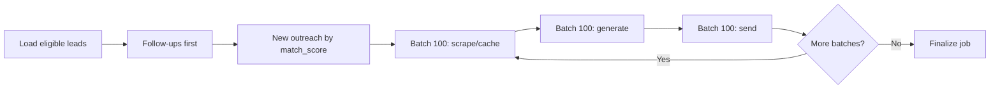

# AI Job Outreach Automation — Full Build Plan

## Current State

The workspace is **greenfield**. Only two assets exist:

- [`21000+ Agency Contact Details - 21K Digital Agencies Contact List.csv`](d:\Converzia - Job reachout - Ujjwal\21000+ Agency Contact Details - 21K Digital Agencies Contact List.csv) — ~21,201 rows, 17 columns matching PRD spec; rich pre-scraped `Description`, `Services`, `Team Bios` fields
- [`ujjwal_details.tex`](d:\Converzia - Job reachout - Ujjwal\ujjwal_details.tex) — sender profile, portfolio/LinkedIn links, experience bullets for prompt context

No code, git repo, Supabase schema, or configs exist yet.

## Architecture



**Key decisions (confirmed):**
- **Webhooks + job orchestration API:** FastAPI deployed on **Render free tier**
- **Daily scheduler:** GitHub Actions cron triggers Render endpoint at 7:00 PM IST
- **Production scraping:** Playwright Python library (not Cursor Playwright MCP — MCP is dev-only)
- **Scope:** Full PRD in one build

---

## Project Structure

```
d:\Converzia - Job reachout - Ujjwal\
├── .github/workflows/daily_outreach.yml
├── render.yaml                       # Render Blueprint (free tier services)
├── Dockerfile                        # Playwright + FastAPI for Render
├── .env.example
├── requirements.txt
├── pyproject.toml                    # optional, for tooling
├── README.md
├── supabase/migrations/
│   └── 001_initial_schema.sql
├── config/
│   └── sender_profile.json           # extracted from ujjwal_details.tex
├── prompts/
│   ├── master_email.txt
│   ├── subject_lines.txt
│   └── followup_templates.txt
├── src/
│   ├── api/                          # FastAPI (Render)
│   │   ├── main.py
│   │   ├── routes/webhooks.py
│   │   ├── routes/jobs.py
│   │   └── routes/health.py
│   ├── core/
│   │   ├── config.py                 # pydantic-settings
│   │   ├── logging.py                # loguru setup
│   │   └── retry.py                  # shared retry decorator
│   ├── db/
│   │   ├── engine.py                 # SQLAlchemy async engine
│   │   └── models.py                 # all 5 PRD tables + extensions
│   ├── schemas/                      # Pydantic request/response models
│   ├── services/
│   │   ├── csv_importer.py
│   │   ├── match_scorer.py
│   │   ├── website_analyzer.py       # Playwright + cache
│   │   ├── llm_client.py             # fallback chain
│   │   ├── email_generator.py
│   │   ├── brevo_client.py           # multi-account
│   │   ├── followup_engine.py
│   │   ├── batch_processor.py        # 100-batch asyncio pipeline
│   │   └── job_runner.py             # resumable daily workflow
│   └── utils/
│       └── url_normalizer.py         # strip UTM, dedupe cache keys
├── streamlit_app/
│   ├── app.py
│   └── pages/
│       ├── 1_dashboard.py
│       ├── 2_leads.py
│       ├── 3_campaigns.py
│       ├── 4_analytics.py
│       ├── 5_failures.py
│       └── 6_settings.py
├── scripts/
│   ├── import_csv.py
│   └── extract_sender_profile.py
└── tests/
    ├── test_match_scorer.py
    ├── test_followup_engine.py
    └── test_llm_fallback.py
```

---

## Phase 1 — Foundation and Database

### 1.1 Initialize repo and dependencies

Create `requirements.txt` with pinned core deps:

- `fastapi`, `uvicorn[standard]`, `httpx`, `aiohttp`
- `sqlalchemy[asyncio]`, `asyncpg`, `supabase` (optional client)
- `pydantic`, `pydantic-settings`, `python-dotenv`
- `playwright`, `loguru`, `streamlit`, `pandas`
- Provider SDKs: `google-generativeai`, `groq`, `openai` (OpenRouter), etc.

Run `playwright install chromium` in Render build command (`render.yaml` or Dockerfile).

### 1.2 Supabase schema

Apply migration via Supabase MCP [`apply_migration`](C:\Users\Acer\.cursor\projects\d-Converzia-Job-reachout-Ujjwal\mcps\user-supabase\tools\apply_migration.json) with these PRD tables plus production extensions:

| Table | PRD fields | Extensions for production |
|-------|-----------|---------------------------|
| `leads` | All PRD columns | `csv_raw JSONB`, `brevo_account INT`, `message_id TEXT`, `do_not_contact BOOL`, unique index on normalized email |
| `website_cache` | All PRD columns | Unique index on normalized domain, `scrape_status`, `error_log` |
| `generated_content` | All PRD columns | `followup_number INT DEFAULT 0`, `validation_passed BOOL` |
| `email_events` | All PRD columns | Index on `(lead_id, event_type)`, `brevo_event_id` for idempotency |
| `jobs` | All PRD columns | `checkpoint JSONB`, `batch_offset INT`, `job_type` enum |

**Status enum:** `NEW → WEBSITE_ANALYZED → EMAIL_GENERATED → EMAIL_SENT → OPENED → CLICKED → REPLIED → INTERESTED → INTERVIEW → HIRED` plus `BOUNCED`, `SPAM`, `FAILED`, `PAUSED`.

**Indexes for 21K+ scale:**
- `leads(match_score DESC, status)` — daily prioritization
- `leads(current_stage, sent_at)` — follow-up queries
- `website_cache(website)` unique
- `jobs(status, job_type)` — resume failed jobs

### 1.3 Environment config

`.env.example` documenting all secrets:

```
SUPABASE_URL, SUPABASE_SERVICE_ROLE_KEY, DATABASE_URL
BREVO_API_KEY_1/2/3, BREVO_SENDER_EMAIL_1/2/3
GEMINI_API_KEY, GROQ_API_KEY, OPENROUTER_API_KEY, CEREBRAS_API_KEY, MISTRAL_API_KEY
RENDER_PUBLIC_URL, WEBHOOK_SECRET
SENDER_PORTFOLIO_URL, SENDER_LINKEDIN_URL, SENDER_RESUME_URL
DAILY_NEW_PER_ACCOUNT=150, DAILY_FOLLOWUP_PER_ACCOUNT=150
LLM_TIMEOUT_SECONDS=5
CACHE_TTL_DAYS=30
```

---

## Phase 2 — CSV Import and Match Scoring

### 2.1 CSV importer ([`scripts/import_csv.py`](scripts/import_csv.py))

- Stream-read CSV with `pandas` chunks (1000 rows) to handle 26MB file
- Normalize: strip UTM params from websites, validate emails, skip rows without email
- Map `Name` → `company_name`, store full CSV row in `csv_raw JSONB`
- Idempotent: upsert on normalized email, never duplicate
- Pre-populate `match_score` and `hiring_probability` at import time using CSV text fields (before Playwright)

### 2.2 Match scoring engine ([`src/services/match_scorer.py`](src/services/match_scorer.py))

Keyword classifier on `Services`, `Description`, `Areas of Expertise`, `Industries`:

| Category | Score |
|----------|-------|
| AI Agency | 95 |
| Automation Agency | 90 |
| Web Development | 85 |
| Marketing | 80 |
| Consulting | 70 |
| General Business | 50 |
| Unrelated | 20 |

Boost score when CSV contains AI/hiring signals (`AI Development`, `LLM`, `Machine Learning`, team bios mentioning AI roles). Daily outreach query: `ORDER BY match_score DESC WHERE status = 'NEW'`.

---

## Phase 3 — Website Analysis and Cache

### 3.1 Cache-first scraper ([`src/services/website_analyzer.py`](src/services/website_analyzer.py))

```
normalize_url(website) → check website_cache (last_scraped < 30 days?) → return cache
else → Playwright scrape → LLM summarize → store cache → return
```

**Pages to attempt (graceful 404 skip):** `/`, `/about`, `/services`, `/team`, `/case-studies`, `/blog`, `/capabilities`

**Extract per PRD JSON:**
```json
{"industry":"","positioning":"","services":[],"specialization":"","hiring_probability":0,"summary":""}
```

**Optimization:** Seed cache from CSV `Description` + `Services` + `Team Bios` on first import so many leads already have website-derived insight before Playwright runs — satisfies PRD Principle 1 even on cache miss delay.

**Retries:** 3 attempts with exponential backoff; log failures to `jobs.error_log`.

**Concurrency:** Semaphore-limited async Playwright (3–5 concurrent browsers max on Render free tier — 512MB RAM limit).

---

## Phase 4 — LLM Fallback Chain and Email Generation

### 4.1 LLM client ([`src/services/llm_client.py`](src/services/llm_client.py))

Provider order with **5-second timeout per provider**, immediate failover:

1. Gemini → 2. Groq → 3. OpenRouter → 4. Cerebras → 5. Mistral

Each provider: 3 retries on transient errors. Log provider used to `generated_content.llm_provider`.

### 4.2 Email generator ([`src/services/email_generator.py`](src/services/email_generator.py))

**Prompt inputs:**
- Website cache JSON + one specific insight (mandatory)
- Sender profile from [`config/sender_profile.json`](config/sender_profile.json) (extracted from [`ujjwal_details.tex`](d:\Converzia - Job reachout - Ujjwal\ujjwal_details.tex))
- Lead company name, specialization

**Validation gate (reject and regenerate):**
- Word count 75–120
- Max 3 paragraphs, 5–7 lines
- Blocklist: buzzwords (`synergy`, `leverage`, ` cutting-edge`, etc.)
- Must contain portfolio + LinkedIn links
- Must reference one website-specific insight (regex/LLM check)

**Subject lines:** Generate 5 candidates, pick highest-scoring (short, agency-specific, no spam words).

**Follow-up content variants:**
- Email 1: Portfolio + LinkedIn only
- Email 2+: Portfolio + LinkedIn + Resume link
- Never-opened follow-up: new subject line from subject prompt

---

## Phase 5 — Brevo Multi-Account Sending

### 5.1 Brevo client ([`src/services/brevo_client.py`](src/services/brevo_client.py))

Three account configs with daily quotas:

| Account | New/day | Follow-up/day |
|---------|---------|---------------|
| 1 | 150 | 150 |
| 2 | 150 | 150 |
| 3 | 150 | 150 |
| **Total** | **450** | **450** |

- Round-robin assignment with per-account daily counters stored in Supabase (`jobs.checkpoint` or a `daily_send_counters` table)
- Tag each send with `lead_id` + `followup_number` in Brevo `tags` / `X-Mailin-custom` header for webhook correlation
- 5 retries on send failure with exponential backoff

### 5.2 Reply tracking setup (manual pre-req)

Brevo **inbound parsing** requires a dedicated subdomain (e.g., `reply.yourdomain.com`) — separate from sending domain. Configure:
- Transactional webhooks: `delivered`, `opened`, `click`, `hard_bounce`, `soft_bounce`, `spam`, `blocked`
- Inbound webhook: `inboundEmailProcessed` for reply detection via `InReplyTo` → `message_id` match

Document this in README as a deployment prerequisite.

---

## Phase 6 — FastAPI on Render (Webhooks + Job API)

### 6.1 Routes ([`src/api/`](src/api/))

| Endpoint | Purpose |
|----------|---------|
| `POST /webhooks/brevo/transactional` | Process delivery/open/click/bounce/spam events |
| `POST /webhooks/brevo/inbound` | Process replies → set `replied_at`, status `REPLIED`, stop follow-ups |
| `POST /jobs/daily-outreach` | Trigger full daily pipeline (auth via `WEBHOOK_SECRET`) — returns `202 Accepted` immediately |
| `POST /jobs/resume/{job_id}` | Resume failed job from checkpoint |
| `GET /health` | Render health check |

**Webhook processing rules (PRD Principles 3–4):**
- Reply received → immediately set `replied_at`, status `REPLIED`, cancel pending follow-ups
- Click > Open > Delivered hierarchy for follow-up decisions
- Idempotent event insert using `brevo_event_id`
- Instant Supabase update on every event

**Long-running job pattern (Render free tier):**
- `/jobs/daily-outreach` returns `202 Accepted` immediately and runs the batch pipeline as a **background asyncio task** — avoids HTTP request timeout on free web services
- Job progress tracked in Supabase `jobs` table; dashboard/Failures page shows live status
- If the service spins down mid-job, `/jobs/resume/{job_id}` picks up from `jobs.checkpoint`

### 6.2 Render deployment (free tier)

Add to project root:

- **`render.yaml`** — Blueprint defining web service(s), env vars, build/start commands
- **`Dockerfile`** — Playwright Chromium system deps + Python app
- **Start command:** `uvicorn src.api.main:app --host 0.0.0.0 --port $PORT`
- **Build command:** `pip install -r requirements.txt && playwright install chromium --with-deps`

**Render free tier services:**

| Service | Plan | Purpose |
|---------|------|---------|
| `outreach-api` | Free Web Service | FastAPI webhooks + background job runner |
| `outreach-dashboard` | Free Web Service (optional) | Streamlit admin panel |

**Free tier notes:**
- Services spin down after ~15 min inactivity — Brevo webhooks and GitHub Actions cron will wake the API on demand
- Cold start adds ~30–60s latency on first webhook/job trigger (acceptable for daily batch; webhooks may retry)
- 512MB RAM — keep Playwright concurrency at 3–5 browsers max
- Public HTTPS URL (e.g. `https://outreach-api.onrender.com`) → register in Brevo webhook settings (all 3 accounts)

---

## Phase 7 — Daily Batch Pipeline

### 7.1 Job runner ([`src/services/job_runner.py`](src/services/job_runner.py))

Triggered by GitHub Actions at **7:00 PM IST** (`cron: '30 13 * * *'` UTC):

```yaml
# .github/workflows/daily_outreach.yml
- curl -X POST $RENDER_URL/jobs/daily-outreach -H "Authorization: Bearer $JOB_SECRET"
```

**Pipeline steps (resumable via `jobs.checkpoint`):**



1. **Follow-ups first** (up to 450/day) — [`followup_engine.py`](src/services/followup_engine.py)
2. **New outreach** (up to 450/day) — highest `match_score` first
3. Process in batches of 100 with asyncio

### 7.2 Follow-up intelligence ([`src/services/followup_engine.py`](src/services/followup_engine.py))

| Condition | Action | Timing |
|-----------|--------|--------|
| Replied | STOP | immediate |
| Clicked, no reply | Personalized follow-up | Day 4 |
| Opened, no click/reply | Standard follow-up | Day 4 |
| Never opened | New subject line | Day 5 |
| Max follow-ups | STOP after 3 | Day 15 |

Schedule: FU1 Day 4, FU2 Day 8, FU3 Day 15. Track via `followup_1_sent`, `followup_2_sent`, `followup_3_sent` timestamps.

---

## Phase 8 — Streamlit Dashboard

Six pages reading Supabase directly:

| Page | Key metrics/actions |
|------|---------------------|
| **Dashboard** | Total leads, sent, open/click/reply rates, positive reply rate, interviews, hires |
| **Leads** | Filterable table, status, match_score, manual status override, pause lead |
| **Campaigns** | Daily send volume by account, new vs follow-up split |
| **Analytics** | Funnel chart, provider success rates, cache hit rate, score distribution |
| **Failures** | Failed jobs, scrape/LLM/send errors with retry button |
| **Settings** | View config, test Brevo/LLM connections, trigger manual job |

Deploy Streamlit as a second **Render free web service** (`outreach-dashboard`) or run locally for admin use.

---

## Phase 9 — Reliability, Logging, and Acceptance

### Error handling
Every failure logged with: timestamp, lead_id, provider, reason, retry_count → `jobs.error_log` JSONB array.

### Retry policy (PRD §21)
- Playwright: 3 retries
- LLM: 3 retries per provider, then failover
- Brevo: 5 retries
- Database: 3 retries

### Job resume
On failure mid-batch, store `batch_offset` + completed lead IDs in `jobs.checkpoint`. `/jobs/resume/{job_id}` continues without re-sending completed leads.

### Performance targets
- Semaphore concurrency tuning for Playwright + LLM
- Cache-first strategy targeting >70% hit rate after initial warm-up
- Target: full daily run <30 minutes with warm cache

### Acceptance test checklist
- Import 21K CSV without duplicates
- Scrape + cache with 30-day TTL
- Generate validated personalized emails
- Send via 3 Brevo accounts with correct quotas
- Webhooks update lead status in real time
- Follow-ups stop on reply
- Failed job resumes safely
- Dashboard shows all PRD metrics

---

## Manual Prerequisites (Before First Run)

You will need to provision externally:

1. **Supabase project** — create via dashboard, apply migrations
2. **3 Brevo accounts** — API keys, verified sender domains, webhook URLs pointing to Render
3. **Inbound reply subdomain** — DNS MX records for Brevo inbound parsing
4. **LLM API keys** — Gemini (primary) + fallbacks
5. **Render account (free tier)** — deploy FastAPI web service + optional Streamlit web service via `render.yaml`
6. **GitHub repo secrets** — `RENDER_URL`, `JOB_SECRET`
7. **Resume PDF URL** — host resume for follow-up emails (follow-up 2+)

---

## Implementation Order

Build in dependency order to enable incremental testing:

1. Schema + config + CSV import
2. Match scorer + sender profile extraction
3. Website analyzer + cache
4. LLM client + email generator
5. Brevo client (single account first, then multi)
6. FastAPI webhooks
7. Follow-up engine + batch job runner
8. GitHub Actions cron
9. Streamlit dashboard (all 6 pages)
10. End-to-end test with small batch (10 leads) before enabling 900/day

---

## Risk Notes

| Risk | Mitigation |
|------|------------|
| Playwright memory on Render free (512MB) | Limit concurrency to 3–5; reuse browser context; batch size 100 |
| Render free spin-down / cold starts | Background job pattern (202 + asyncio); `/jobs/resume` for mid-job recovery; Brevo retries webhooks |
| Render free HTTP timeout on long jobs | Never block the request — return 202 immediately, run pipeline in background |
| Brevo daily limits / reputation | Warm up gradually; respect 150+150 per account |
| LLM 5s timeout too aggressive | Log timeout rate; make timeout configurable in Settings |
| CSV emails may include generic `info@` addresses | PRD allows; optionally deprioritize non-personal emails |
| GitHub Actions only triggers — Render runs heavy work | Keeps GHA within limits; job runs on Render as background task |
